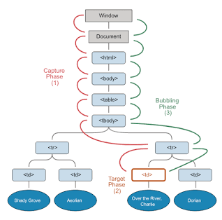

# Mastering DOM Events: From Basic Propagation to Advanced Custom Workflows

Every interaction in the browser—clicks, scrolls, typing, hovers—is powered by DOM events.

If you want to build fast, predictable, interactive web apps, you don’t just need to know *how to listen* to events. You need to understand *how events move through the system*.

This is where most developers plateau: they treat events as callbacks.

But the browser treats them as a **propagation system**.

---



> An event does not happen in one place.
>
> It travels through a structured lifecycle inside the DOM tree.

### The 3 Phases of Event Propagation

* **Capturing Phase**: The event travels *down* from `Window → Document → ancestors → target`
* **Target Phase**: The event reaches the actual element that triggered it
* **Bubbling Phase**: The event travels *back up* the DOM tree

By default, most event listeners run in the **bubbling phase**, which is why DOM behavior often feels “inside-out”.

---

## Part 1: Event Propagation (The DOM as a Signal Network)

Think of the DOM not as a tree of elements, but as a **bidirectional signal system**.

A click is not delivered directly to a node—it is *broadcast through structure*.

### Key Mental Model

* Downward traversal = *capturing*
* Hit target = *execution point*
* Upward traversal = *bubbling return path*

### Experiment: Observing Full Propagation

Your lab already demonstrates this well. One refinement that makes the model clearer is to explicitly separate phase order in logs:

* Capturing listeners run first (top → down)
* Target executes in the middle
* Bubbling listeners run last (bottom → up)

The important insight:

> The DOM is not reactive at a point. It is reactive along a path.

### Propagation Control: `stopPropagation()`

Stopping propagation is effectively placing a **circuit breaker** in the signal chain.

```js
e.stopPropagation();
```

This does not “cancel the event globally”—it only prevents further traversal along the DOM path.

---

## Part 2: Event Delegation (Turning the DOM into a Router)

Attaching listeners to every element is not scalable.

It creates:

* memory overhead
* duplicate handlers
* dynamic binding complexity

But DOM events already solve this problem for you.

Because events bubble.

### Core Idea

Instead of:

> “Each child listens for itself”

You do:

> “One parent routes events for all children”

### Why This Works

Event delegation relies on:

* `event.target` → what was actually clicked
* `closest()` → map raw target → logical component
* bubbling → ensures parent always receives events

### Architectural Insight

Delegation turns the DOM into a **single-event router**.

This is why it scales effortlessly for:

* infinite lists
* dynamic UIs
* real-time DOM updates

No re-binding required.

---

## Part 3: Custom Events (Decoupling UI Systems)

Native events (`click`, `input`, `scroll`) describe *user actions*.

But real applications need events that describe *business meaning*.

Examples:

* `video:completed`
* `cart:updated`
* `user:upgraded`
* `upload:finished`

### The Problem Custom Events Solve

Without them:

* components call each other directly
* tight coupling spreads across UI
* state flow becomes implicit and brittle

### Custom Events as a Messaging Layer

```js
new CustomEvent("video:completed", {
  detail: payload,
  bubbles: true
});
```

The key idea:

> `detail` becomes your application-level data channel.

### Architectural Model

You are building a **pub-sub system on top of the DOM**:

* Producer → dispatches event
* DOM → transports it
* Consumers → subscribe independently

No direct references required.

### Why This Scales

Custom events enable:

* micro-frontend communication
* plugin-based architectures
* decoupled UI modules
* analytics pipelines without coupling to UI logic

---

## Architectural Summary

| Pattern       | What It Solves            | Mental Model            |
| ------------- | ------------------------- | ----------------------- |
| Propagation   | Understanding event flow  | DOM as a signal pathway |
| Delegation    | Performance + scalability | DOM as an event router  |
| Custom Events | Decoupled architecture    | DOM as a message bus    |

---

## The Real Insight

Most developers think:

> “I attach listeners to elements.”

But the browser actually behaves like:

> “I propagate signals through a structured system, and you can intercept them at multiple layers.”

Once you internalize that, you stop writing UI code…

…and start designing **interaction systems**.

# Part 4: The Hidden Layer — Event Loop, Rendering, and Event Timing

DOM events don’t exist in isolation.

They sit on top of **two competing systems** inside the browser:

1. The **Event Loop (JS execution model)**
2. The **Rendering Pipeline (visual update model)**

Most confusion in real-world frontend work comes from mixing these two in your mental model.

---

## 4.1 The Core Misconception

Many developers assume:

> “Click → handler runs → UI updates immediately”

But the real sequence is closer to:

> Click → Event Loop schedules handler → JS runs → Microtasks flush → Render pipeline runs → Paint → Composite

So the key insight is:

> DOM events do NOT directly trigger rendering. They trigger JavaScript execution, which *eventually* leads to rendering.

---

## 4.2 Where DOM Events Actually Sit

A click event is:

* captured by the browser’s input system (outside JS)
* queued into the **macrotask queue**
* executed by the event loop when JS is free

So:

> DOM events are **macrotasks**.

That means they compete with:

* `setTimeout`
* `setInterval`
* UI input events
* message events

---

## 4.3 The Real Execution Pipeline (Simplified)

When you click a button:

1. 🧠 **Macrotask begins**

   * event handler runs (your click callback)

2. ⚡ **Microtasks flush immediately after**

   * `Promise.then`
   * `queueMicrotask`

3. 🎨 **Rendering phase (browser decides)**

   * style recalculation
   * layout
   * paint
   * composite

4. 🔁 Next macrotask starts

---

## 4.4 Why UI Sometimes “Feels Broken”

Let’s connect this to real symptoms:

### Case A: “Why doesn’t the UI update inside my click handler?”

Because:

```js
button.addEventListener("click", () => {
  element.style.background = "red";

  while (true) {} // blocks rendering
});
```

You just:

* changed DOM state
* but blocked the thread before render could happen

👉 The browser cannot paint mid-task.

---

### Case B: “Why do multiple state updates render as one?”

Because the browser batches rendering:

```js
button.addEventListener("click", () => {
  box.style.width = "100px";
  box.style.width = "200px";
  box.style.width = "300px";
});
```

Only the **final state survives before paint**.

---

## 4.5 Layout Thrashing = Event Loop Abuse

This connects directly to your rendering lab.

When you do this inside an event handler:

```js
element.addEventListener("click", () => {
  const width = element.offsetWidth; // forces layout

  element.style.width = width + 1 + "px"; // invalidates layout
});
```

You are forcing:

> JS → layout → JS → layout → JS → layout (repeat)

This is called:

> **Synchronous layout reflow inside a macrotask**

And it blocks:

* rendering
* input responsiveness
* scroll performance

---

## 4.6 Why `requestAnimationFrame` Exists

`requestAnimationFrame` aligns JS execution with:

> the browser’s rendering cycle

So instead of:

* JS runs whenever event fires

You get:

* JS runs right before paint

### Correct mental model:

| Without rAF                | With rAF                    |
| -------------------------- | --------------------------- |
| “Do work immediately”      | “Do work before next frame” |
| unpredictable paint timing | synchronized rendering      |
| jank-prone animations      | smooth frame pacing         |

---

## 4.7 Event → Render Interaction Model

Here’s the full system diagram:

```
User Input
   ↓
Event Queue (macrotask)
   ↓
JS Event Handler Runs
   ↓
Microtasks Flush (Promises)
   ↓
Browser Checks: “Is rendering needed?”
   ↓
Style → Layout → Paint → Composite
   ↓
Frame presented
   ↓
Next event loop cycle
```

---

## 4.8 The Real Source of “Input Lag”

Input lag is not slow JavaScript.

It is:

> JS blocking the rendering phase after the input event is delivered.

Common causes:

* heavy click handlers
* layout thrashing
* synchronous loops
* long-running microtask chains (starvation)

---

## 4.9 Microtask Starvation (Why UI “Freezes”)

This is the subtle killer:

```js
function loop() {
  Promise.resolve().then(loop);
}
loop();
```

This creates:

> infinite microtask chaining

Result:

* macrotasks never run
* rendering never happens
* UI freezes despite “fast JS”

Because:

> Rendering only happens *after microtasks clear*

---

## 4.10 The Unified Mental Model

Now connect everything in your repo:

### Events Module

→ defines *how input enters the system*

### Event Loop Module

→ defines *when JS executes that input*

### Rendering Pipeline Module

→ defines *when visual output is allowed*

---

## Final Insight

If you compress everything:

> DOM events are not UI reactions.
> They are scheduled jobs inside a time-sharing system between JavaScript and the rendering engine.

Once you see that:

* delegation becomes routing optimization
* propagation becomes signal traversal
* custom events become architecture design
* rendering bugs become scheduling issues

# Part 5: Unified Browser Runtime Model (The Mental Simulation Layer)

The browser is not a collection of independent systems.

It is a **single coordinated execution machine** with three tightly coupled subsystems:

1. **Event System (Input → Signals)**
2. **JavaScript Runtime (Execution → Control Flow)**
3. **Rendering Engine (State → Pixels)**

If you understand how these three interleave, you can predict nearly every “why is this janky?” or “why didn’t this update?” bug.

---

## 5.1 The One Model That Replaces Everything

Instead of thinking:

* Event loop
* DOM events
* rendering pipeline
* microtasks/macrotasks

Think:

> The browser runs a continuous cycle of **“input → compute → render”**

Every frame is just this loop repeated.

---

## 5.2 The Browser Frame Cycle (Core Truth)

Each frame follows this deterministic structure:

```text
(1) Input Collection
    - clicks
    - scroll
    - network events
    - timers

(2) JS Execution Phase (Macrotask)
    - event handlers run
    - setTimeout callbacks run

(3) Microtask Drain
    - Promises
    - queueMicrotask
    - mutation observers

(4) Rendering Decision Point
    - did DOM/style change?

(5) Render Pipeline
    - style → layout → paint → composite

(6) Frame Presentation
```

Then repeat.

---

## 5.3 Key Insight: Everything Competes for the Same Thread

There is only **one main thread** doing:

* event handling
* JS execution
* layout calculations
* style recalculation

So the real constraint is:

> Not speed. **Scheduling.**

---

## 5.4 DOM Events in the Unified Model

DOM events are NOT special.

They are simply:

> Macrotasks injected into the event loop by the input system

So:

```text
click event
→ queued
→ becomes macrotask
→ runs JS handler
```

This means:

* click handlers do NOT interrupt rendering
* they WAIT for the JS turn
* rendering waits for them to finish

---

## 5.5 The Hidden Dependency Chain

A single line inside an event handler can cascade:

```js id="8xqv4n"
button.addEventListener("click", () => {
  box.style.width = "300px"; // style invalidation
});
```

This triggers:

```text
JS runs
→ style invalidation flagged
→ layout deferred
→ paint scheduled after JS + microtasks
```

Nothing happens immediately.

Everything is deferred until the browser reaches a safe render point.

---

## 5.6 Why UI Updates Feel Non-Deterministic

Because updates are **batched between phases**, not executed inline.

### Example:

```js id="q9xk2m"
button.addEventListener("click", () => {
  box.style.width = "100px";
  box.style.width = "200px";
  box.style.width = "300px";
});
```

Actual result:

> Only the final value matters at render time

Because rendering happens **after the macrotask completes**, not during it.

---

## 5.7 Microtasks: The Invisible Priority Layer

Microtasks are dangerous because they:

> run BEFORE rendering AND BEFORE next macrotask

So the real order is:

```text
JS event handler
→ microtasks (Promises)
→ THEN render
```

### Implication:

If you chain microtasks:

```js id="p3v8kq"
Promise.resolve().then(() => {
  Promise.resolve().then(() => {
    Promise.resolve().then(...)
  });
});
```

You can **delay rendering indefinitely**.

This is called:

> Microtask starvation of the rendering pipeline

---

## 5.8 Rendering is Not Event-Driven

Important correction:

> Rendering does NOT happen because something changed.

Rendering happens because:

> The browser reached a safe checkpoint after JS + microtasks

This is why:

* DOM mutations do nothing immediately
* layout is deferred
* paint is scheduled
* animations are frame-aligned

---

## 5.9 Layout + Event Loop Coupling (The Real Performance Killer)

This is where most “frontend slowness” comes from.

If you read layout inside JS:

```js id="r7kz2p"
element.offsetHeight
```

You force:

> immediate layout flush inside a macrotask

Now the cycle becomes:

```text
JS → layout → JS → layout → JS
```

Instead of:

```text
JS → batch → layout → paint
```

This is why layout thrashing destroys performance.

---

## 5.10 requestAnimationFrame = Frame Boundary Hook

`requestAnimationFrame` plugs into:

> the exact boundary between JS and rendering

So:

```text
macrotask (event handler)
→ microtasks
→ rAF callback
→ style/layout/paint
→ frame
```

Meaning:

> rAF is the only safe place to coordinate DOM writes for animation

---

## 5.11 The Unified Mental Model (FINAL FORM)

Compress everything into one system:

```text
┌──────────────────────────────┐
│ INPUT SYSTEM                 │
│ click / scroll / network     │
└──────────────┬───────────────┘
               ↓
┌──────────────────────────────┐
│ EVENT LOOP (JS EXECUTION)    │
│ macrotasks                   │
│ microtasks                   │
└──────────────┬───────────────┘
               ↓
┌──────────────────────────────┐
│ STATE DIFFING                │
│ DOM + style invalidation     │
└──────────────┬───────────────┘
               ↓
┌──────────────────────────────┐
│ RENDER PIPELINE              │
│ style → layout → paint       │
└──────────────┬───────────────┘
               ↓
┌──────────────────────────────┐
│ GPU COMPOSITOR              │
│ final pixels on screen       │
└──────────────────────────────┘
```

---

## 5.12 What “Senior Frontend Thinking” Actually Means

Once you internalize this model:

You stop thinking in:

* “why didn’t my click work?”

and start thinking in:

* “which phase am I blocking?”
* “am I starving microtasks?”
* “did I force layout mid-macrotask?”
* “am I desynced from frame boundaries?”

---

## 5.13 The Big Realization

Everything in my repo now collapses into one idea:

> The browser is a time-sliced reactive pipeline, not a DOM execution environment.

And all frontend behavior is just:

* scheduling
* batching
* propagation
* and render timing

